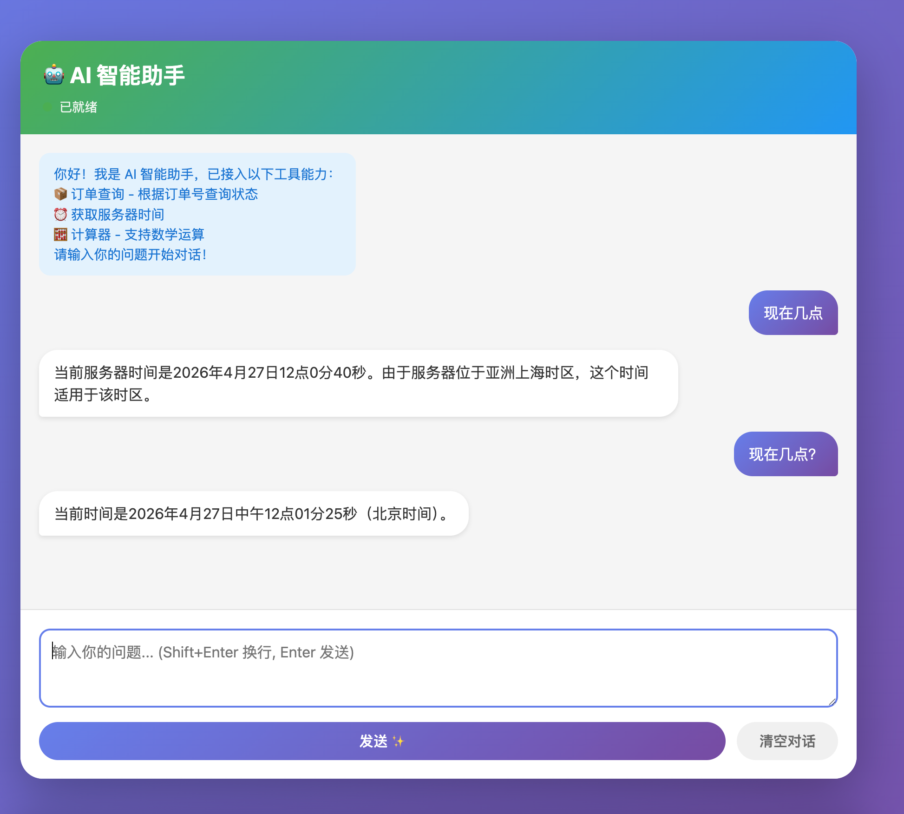
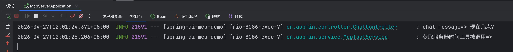

# Spring AI + MCP 示例项目

## 项目简介

本项目实现了 MCP 服务器和 MCP 客户端功能，以及如何通过 Spring AI 集成 MCP 工具并与大语言模型（LLM）交互。






### 项目特性

- **MCP 服务器**：通过 `@Tool` 注解暴露工具方法，供 AI 模型调用
- **MCP 客户端**：可连接其他 MCP 服务器，使用其提供的工具
- **Spring AI 集成**：使用 Ollama 本地模型进行对话
- **工具示例**：包含订单查询、时间获取、计算器三个实用工具

## 项目结构

```
mcp-server/
├── src/main/java/cn/aopmin/
│   ├── McpServerApplication.java      # 主启动类
│   ├── config/
│   │   └── McpConfig.java             # Spring AI 核心配置
│   ├── controller/
│   │   └── ChatController.java        # 聊天 API 控制器
│   └── service/
│       ├── ChatService.java           # 聊天服务
│       └── McpToolService.java        # MCP 工具服务
├── src/main/resources/
│   └── application.yml                # 应用配置
├── pom.xml                            # Maven 依赖
└── note/                              # 项目文档
```

## 接入步骤

### 1. 环境准备

- Java 17+
- Maven 3.6+
- Ollama（本地运行大语言模型）

### 2. 安装并启动 Ollama

```bash
# 安装 Ollama（参考 https://ollama.com）
# 拉取模型（示例使用 qwen2.5:7b）
ollama pull qwen2.5:7b

# 启动 Ollama 服务（默认端口 11434）
ollama serve
```

### 3. 配置项目

编辑 `src/main/resources/application.yml`：

```yaml
spring:
  ai:
    ollama:
      base-url: http://localhost:11434
      chat:
        options:
          model: qwen2.5:7b    # 替换为你的模型
          temperature: 0.7
```

### 4. 启动项目

```bash
mvn spring-boot:run
```

项目启动后，默认端口为 8086，可在 `application.yml` 中修改。

### 5. 测试 API

项目提供了三个测试命令（启动时会打印）：

```bash
# 查询订单状态
curl -X POST http://localhost:8086/api/chat \
  -H "Content-Type: application/json" \
  -d '{"message":"查询订单ORD-001的状态"}'

# 查询服务器时间
curl -X POST http://localhost:8086/api/chat \
  -H "Content-Type: application/json" \
  -d '{"message":"现在几点？"}'

# 计算器
curl -X POST http://localhost:8086/api/chat \
  -H "Content-Type: application/json" \
  -d '{"message":"计算 123 + 456"}'
```

## Spring AI 如何识别 MCP 工具

Spring AI 通过以下机制识别和注册 MCP 工具：

### 1. 使用 `@Tool` 注解

在服务类的方法上添加 `@Tool` 注解，声明该方法为 MCP 工具：

```java
@Service
public class McpToolService {
    
    @Tool(description = "根据订单ID查询订单的当前状态和详细信息")
    public Map<String, Object> getOrderStatus(
            @ToolParam(description = "订单唯一标识符，如 ORD-001") String orderId) {
        // 实现逻辑
    }
}
```

### 2. 配置 `ToolCallbackProvider`

在 `McpConfig` 中注册工具提供者：

```java
@Bean
public ToolCallbackProvider mcpToolProvider(McpToolService mcpToolService) {
    return MethodToolCallbackProvider.builder()
            .toolObjects(mcpToolService)
            .build();
}
```

### 3. 绑定到 ChatClient

将工具回调函数绑定到 ChatClient，使 AI 模型能够调用这些工具：

```java
@Bean
public ChatClient chatClient(OllamaChatModel ollamaChatModel,
                             List<ToolCallbackProvider> toolCallbackProviders) {
    
    // 提取所有工具回调函数
    List<FunctionCallback> functionCallbacks = toolCallbackProviders.stream()
            .flatMap(provider -> Arrays.stream(provider.getToolCallbacks())).toList();
    
    // 构建 ChatClient 并注册工具
    return ChatClient.builder(ollamaChatModel)
            .defaultFunctions(functionCallbacks.toArray(new FunctionCallback[0]))
            .build();
}
```

### 4. 工具调用流程

1. 用户发送消息到 `/api/chat` 端点
2. `ChatService` 使用 `ChatClient` 调用 AI 模型
3. AI 模型分析用户意图，决定是否需要调用工具
4. 如果需要调用工具，AI 模型生成工具调用请求
5. Spring AI 执行对应的工具方法
6. 将工具执行结果返回给 AI 模型
7. AI 模型生成最终回复并返回给用户

## 项目角色说明

### MCP 服务器

- **功能**：通过 `@Tool` 注解暴露工具方法
- **配置**：`application.yml` 中 `spring.ai.mcp.server.enabled=true`
- **端点**：`/mcp`（Streamable HTTP 协议）

### MCP 客户端

- **功能**：连接其他 MCP 服务器，使用其提供的工具
- **配置**：`application.yml` 中 `spring.ai.mcp.client.enabled=true`
- **服务器 URL**：`http://localhost:8086`（可配置）

## MCP 通信协议

前后端 MCP 通过 **Streamable HTTP 协议** 进行通信，这是 Model Context Protocol (MCP) 的标准通信方式。

### 通信方式

1. **协议支持**：
   
   - **STREAMABLE**：流式 HTTP 协议（推荐）
   - **HTTP**：传统 HTTP 协议
   
2. **通信端点**：
   - MCP 服务器端点：`/mcp`
   - 完整 URL：`http://localhost:8086/mcp`

3. **通信流程**：
   
   ```
   客户端 (MCP Client)          服务器 (MCP Server)
        |                            |
        |--- 连接请求 (/mcp) ------->|
        |                            |
        |<-- 工具列表响应 -----------|
        |                            |
        |--- 工具调用请求 ---------->|
        |                            |
        |<-- 工具执行结果 -----------|
        |                            |
   ```

### 依赖组件

项目使用以下 MCP SDK 组件实现通信：

```xml
<dependency>
    <groupId>io.modelcontextprotocol.sdk</groupId>
    <artifactId>mcp</artifactId>
    <version>0.9.0</version>
</dependency>
<dependency>
    <groupId>io.modelcontextprotocol.sdk</groupId>
    <artifactId>mcp-spring-webmvc</artifactId>
    <version>0.9.0</version>
</dependency>
```

### 配置说明

在 `application.yml` 中配置通信协议：

```yaml
spring:
  ai:
    mcp:
      server:
        protocol: STREAMABLE  # 支持 STREAMABLE 和 HTTP 两种协议
        streamable-http:
          mcp-endpoint: /mcp  # MCP 服务端点
```

### 通信特点

1. **流式传输**：支持实时数据流传输，适合长时间运行的任务
2. **低延迟**：基于 HTTP 协议，网络开销小
3. **标准化**：遵循 MCP 协议规范，兼容不同实现
4. **可靠性**：支持重连机制，网络中断后可恢复连接

### 前后端交互示例

1. **前端/客户端** 发送请求到 `/mcp` 端点
2. **MCP 服务器** 接收请求并解析协议数据
3. **服务器** 执行对应的工具方法
4. **服务器** 将结果通过流式响应返回给客户端
5. **客户端** 接收响应并处理结果

## 配置说明

### Ollama 配置

```yaml
spring:
  ai:
    ollama:
      base-url: http://localhost:11434
      chat:
        options:
          model: qwen2.5:7b
          temperature: 0.7
```

### MCP 服务器配置

```yaml
spring:
  ai:
    mcp:
      server:
        enabled: true
        name: mcp-server
        version: 1.0.0
        protocol: STREAMABLE  # 支持 STREAMABLE 和 HTTP 两种协议
        capabilities:
          tools: true
          resources: false
          prompts: false
        streamable-http:
          mcp-endpoint: /mcp
```

### MCP 客户端配置

```yaml
spring:
  ai:
    mcp:
      client:
        enabled: true
        server-url: http://localhost:8086
        request-timeout: 30s
```

## 常见问题

| 问题 | 解决方案 |
|------|----------|
| `@Tool` 方法未被识别 | 检查 `ToolCallbackProvider` 是否正确注册了 Service Bean |
| SSE 连接失败 | 检查端口是否正确，防火墙是否阻止，依赖版本是否匹配 |
| LLM 未调用工具 | 检查工具描述 (`description`) 是否清晰，LLM 是否支持 MCP |
| 依赖冲突 | 确保 Spring Boot 和 Spring AI 版本兼容，参考 Spring AI Reference |

## 技术栈

- **Spring Boot**: 3.2.5
- **Spring AI**: 1.0.0-M7
- **Java**: 17
- **Ollama**: 本地大语言模型服务
- **Maven**: 项目构建工具

## 参考资料

- [Spring AI 官方文档](https://docs.spring.io/spring-ai/reference/)
- [MCP 协议规范](https://modelcontextprotocol.io/)
- [Ollama 官方网站](https://ollama.com)
